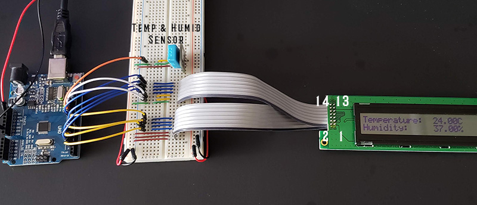

# Arduino Projects

## Various Arduino projects in the works

This repo is the home of my Arduino projects folder. I've got a multitude of spare scrap electronics laying around and I'm trying to put them to good use.
I'll be overjoyed if any of my code helps someone with their projects.

## LCD_Temp-Humi-Sensor
### 40x2 LCD Display

This script reads the Temperature & Humidity sensor every 2500ms. The T&H are displayed on an Optrex DMC50037N 40X2 LCD (Marked PWB50037C-CEM). The LCD runs on a Sanyo LCD7985NA driver. If the Sensor cannot be read an error is displayed.

## Temp_Humidity_Sensor_to_RGB
### RGB LED / Temperature & Humidity

This script Reads the DHT11 Humidity & Temperature sensor. The sensor data is printed in the serial monitor. Sensor data is interpolated via ledColor() to return a value of 0-255. Code was written after 30 hours of no sleep, try not to judge too harshly.
